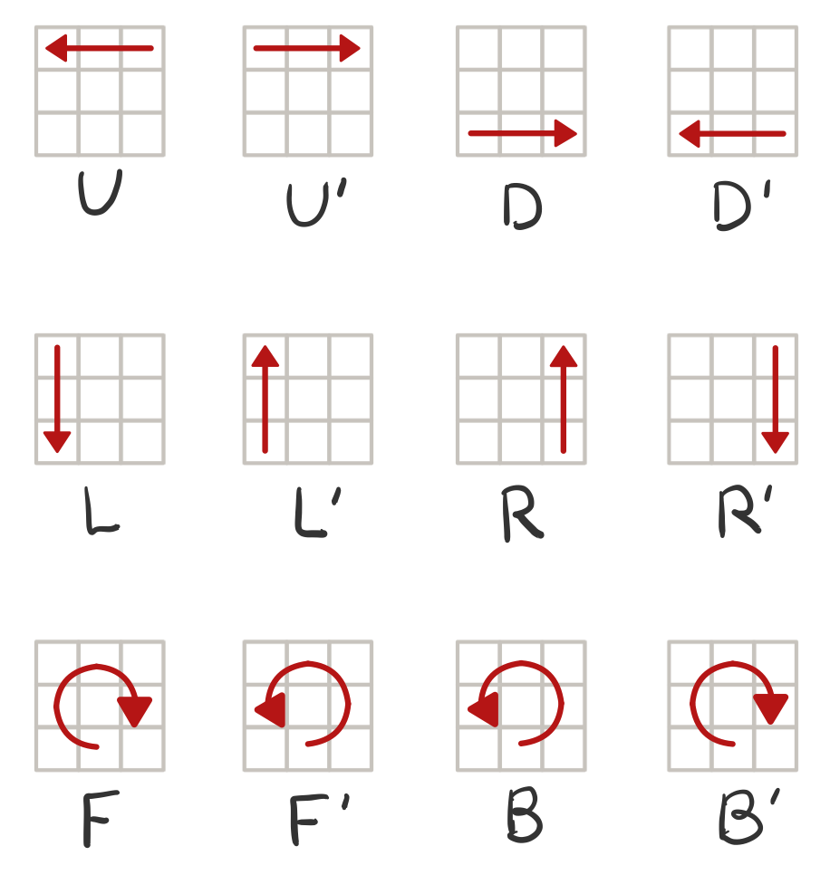

# RubiksCube
루빅스 큐브 구현

## Step-1
### 구현단계
- [x] 마크업 구조
  - 단어, 정수(밀어내고 싶은 수), 밀어낼 방향 입력창
  - 결과값 확인 버튼
- [x] input에 입력된 값이 없을 경우, 입력하라는 경고창 띄운다.
- [x] 정수는 -100보다 크거나 같고 100보다 작아야한다.( -100 <= N < 100)
  - 정수보다 단어의 길이가 클 수 있다.
  - 단어의 길이의 배수로 정수를 나누고, 나머지 값으로 단어를 밀어낸다.
- [x] 밀어낼 방향은 우는 R, 좌는 L로 나타낸다.
  - 대소문자 모두 입력 가능하다.
## Step-2: 평면 큐브 구현하기
### TODO
- [x] 마크업 구조
  - 3 X 3의 2차원 큐브 모양으로 초기 상태 출력
    ```
    R R W
    G C W
    G B B
    ```
단계별 루빅스 큐브 구현

## Step-3: 루빅스 큐브 구현하기
### TODO
- [x] 마크업 구조
  - 큐브의 6면을 펼친 상태(정육면체 평면도)로 출력
  ```
            B B B
            B B B
            B B B

  W W W     O O O     G G G     Y Y Y
  W W W     O O O     G G G     Y Y Y
  W W W     O O O     G G G     Y Y Y
  
            R R R
            R R R
            R R R
  ```
  - 조작코드 입력창
  - 결과값 확인 버튼
- [x] input에 입력된 조작코드가 없을 경우, 입력하라는 경고창 띄운다.
- [x] 조작코드별 동작에 맞는 조건을 만든다.
- [x] 조작코드가 2자리 이상일 때, 조작별 과정을 순서대로 출력한다.
<<<<<<< HEAD

### Advanced
- [x]순환 회전 `C`, `C'` – (순환: Circulation)

### 큐브 조작 방법
⚠ 조작코드는 대소문자를 구분하지 않는다.
#### 프로그램 종료
- `Q` - Bye~를 출력하고 프로그램을 종료한다.
#### 회전 방향
- 시계방향: `'`이 없이 알파벳만 있는 경우
- 반시계방향: `'`이 알파벳 뒤에 존재하는 경우 (예) `U'`)
=======
- [x] Q코드로 프로그램이 종료되면, 조작 받은 명령의 갯수를 출력한다.

### Advanced
- [ ] 프로그램 종료 시, 경과 시간 출력
- [ ] 큐브의 Mix 구현
  - 무작위 섞는 기능
- [ ] 큐브의 Reset 구현
  - 무작위 상태로 다시 시작하는 기능
- [ ] 모든 면을 맞추면 축하 메시지와 함께 프로그램을 자동 종료

### 큐브 조작 방법
#### 회전 방향
- 시계방향: `'`이 없이 알파벳만 있는 경우
- 반시계방향: `'`이 알파벳 뒤에 존재하는 경우 (예) `F'`)
>>>>>>> step-3

#### 회전 위치
- `U`, `U'` – 상 (Up)
- `D`, `D'` – 하 (Down)
- `L`, `L'` – 좌 (Left)
- `R`, `R'` – 우 (Right)
<<<<<<< HEAD
#### 조작코드별 동작되는 위치와 방향


#### 주의사항
  - **`B`**의 경우도 **`U`**와 **방향이 반대**임을 주의한다.
  - **`L`**의 경우 **`R`**과 **방향이 반대**임을 주의한다.

## 코드 설명
- `fillCubeCell()`: 큐브 셀 채우기
- `handleClickEvent()`: 조작코드에 따라 큐브가 움직이는 함수
- `RunCodeSequentially()`: 입력값을 조작코드별로 구분하여 배열에 담는 함수
- `moveCube()`: 조작코드별 이벤트 작동하는 함수
- `rotateLine()`: 회전하는 면 위치 선택 함수
- `moveCirculation()`: 큐브의 면을 회전시키는 함수
- `moveDirLift()`: 큐브의 상/하를 좌측으로 회전시키는 함수
- `moveDirRight()`: 큐브의 상/하를 우측으로 회전시키는 함수
- `moveVerticality()`: 큐브의 좌우을 회전시키는 함수
=======
- `F`, `F'` – 앞 (Front)
- `B`, `B'` – 뒤 (Back)
#### 조작코드별 동작되는 위치와 방향


## 코드 설명
- `initCubeArray`: 초기 배열
- `CUBE_CODE`: 입력코드
- `CUBE_FACE`: 움직이는 면
- `CUBE_DIR`: 움직이는 방향
- `movingLineArray`: 움직이는 줄 배열
- `movingCellArray`: 움직이는 셀 배열
- `fillCubeCell()`: 큐브 셀 채우기
- `handleClickEvent()`: 조작코드에 따라 큐브가 움직이는 함수
- `RunCodeSequentially()`: 입력값을 조작코드별로 구분하여 배열에 담는 함수
- `rotateLine()`: 회전하는 면 위치 선택 함수
- `rotatePosition()`: 회전하는 셀 위치 선택 함수
- `categorizeCode()`: 조작코드별 이벤트 작동하는 함수
- `selectMovingFace()`: 움직이는 면 선택하는 함수
- `rotateFaceOfCube()`: 큐브의 면을 회전시키는 함수
- `rotateTop()`: 큐브의 상단을 회전시키는 함수
- `rotateBottom()`: 큐브의 하단을 회전시키는 함수
- `rotateUp()`: 큐브의 측면을 아래서 위로 회전시키는 함수
- `rotateDown()`: 큐브의 측면을 위에서 아래로 회전시키는 함수
- `rotateFront()`: 큐브의 정면을 회전시키는 함수
- `rotateBack()`: 큐브의 후면을 회전시키는 함수
>>>>>>> step-3
- `extendFlatArray()`: 다차원 배열을 1차원 배열로 변경하는 함수
