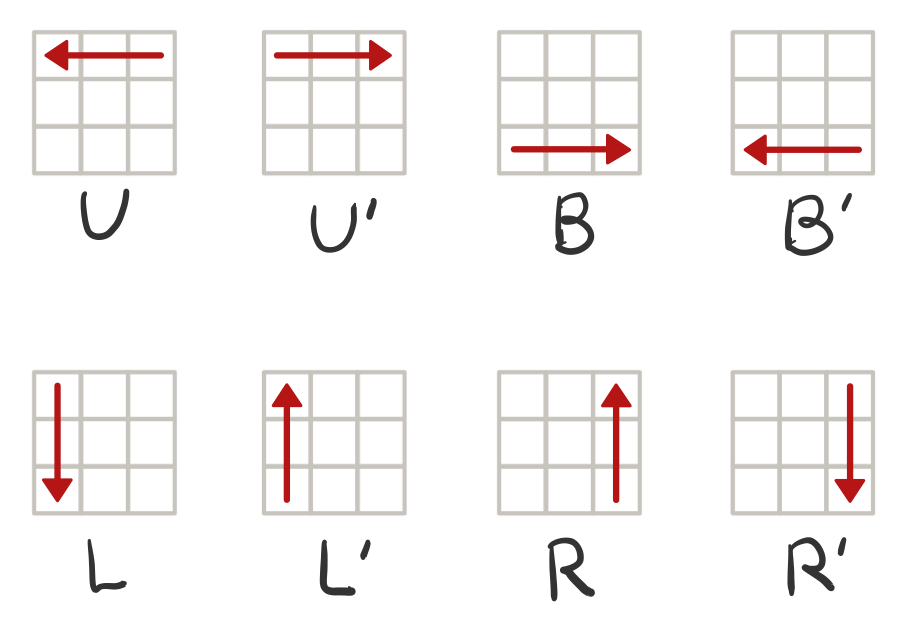

# RubiksCube
루빅스 큐브 구현

## Step-2: 평면 큐브 구현하기
### TODO
- 마크업 구조
  - 3 X 3의 2차원 큐브 모양으로 초기 상태 출력
    ```
    R R W
    G C W
    G B B
    ```
  - 조작코드 입력창
  - 결과값 확인 버튼
- input에 입력된 조작코드가 없을 경우, 입력하라는 경고창 띄운다.
- 조작코드가 2자리 이상일 때, 조작별 과정을 순서대로 출력한다.

### Advanced
- 순환 회전 `C`, `C'` – (순환: Circulation)

### 큐브 조작 방법
⚠ 조작코드는 대소문자를 구분하지 않는다.
#### 프로그램 종료
- `Q` - Bye~를 출력하고 프로그램을 종료한다.
#### 회전 방향
- 시계방향: `'`이 없이 알파벳만 있는 경우
- 반시계방향: `'`이 알파벳 뒤에 존재하는 경우 (예) `U'`)

#### 회전 위치
- `U`, `U'` – 상 (Up)
- `D`, `D'` – 하 (Down)
- `L`, `L'` – 좌 (Left)
- `R`, `R'` – 우 (Right)
#### 조작코드별 동작되는 위치와 방향


#### 주의사항
  - **`B`**의 경우도 **`U`**와 **방향이 반대**임을 주의한다.
  - **`L`**의 경우 **`R`**과 **방향이 반대**임을 주의한다.

## 코드 설명
- `fillCubeCell()`: 큐브 셀 채우기
- `handleClickEvent()`: 조작코드에 따라 큐브가 움직이는 함수
- `RunCodeSequentially()`: 입력값을 조작코드별로 구분하여 배열에 담는 함수
- `moveCube()`: 조작코드별 이벤트 작동하는 함수
- `rotateLine()`: 회전하는 면 위치 선택 함수
- `moveCirculation()`: 큐브의 면을 회전시키는 함수
- `moveDirLift()`: 큐브의 상/하를 좌측으로 회전시키는 함수
- `moveDirRight()`: 큐브의 상/하를 우측으로 회전시키는 함수
- `moveVerticality()`: 큐브의 좌우을 회전시키는 함수
- `extendFlatArray()`: 다차원 배열을 1차원 배열로 변경하는 함수
